# Quina Lottery Simulation Platform — Complete Design Document

**Version:** 2.0  
**Date:** November 20, 2025  
**Status:** Draft for PO Review

---

## Document Structure

**Part I - Executive Overview** (for Product Owners and Stakeholders)
- Business context and value proposition
- Visual architecture with Mermaid diagrams
- Key user workflows and journeys
- System capabilities overview

**Part II - Technical Specification** (for Development Team)
- Detailed database schemas
- Complete API specifications
- Service layer architecture
- Implementation guidelines

---

# PART I — EXECUTIVE OVERVIEW

## 1. Executive Summary

### What We're Building

A **web-based simulation platform** for Quina lottery analysis that transforms our existing command-line tools into a professional HTTP API service. The system enables users to:

- **Import** official lottery results from spreadsheets
- **Run simulations** with configurable prediction algorithms
- **Analyze** performance across thousands of scenarios
- **Track finances** to validate real-world profitability
- **Export insights** via dashboards and PDF reports

### Why It Matters

**Current State (Problems):**
- Manual execution via command-line requires technical knowledge
- Results scattered across files and terminals
- No centralized history or comparison between experiments
- Financial tracking is manual and error-prone
- Difficult to reproduce experiments or share findings

**Future State (Benefits):**
- Web API accessible to non-technical users
- Centralized database of all simulations and results
- Reproducible experiments via JSON configuration files
- Automated financial ledger tracking wins/losses
- Professional reports and dashboards for decision-making

### Business Value


---

## 2. High-Level Architecture

### System Overview


### Component Responsibilities

| Component | Responsibility |
|-----------|---------------|
| **HTTP API** | Receives requests, validates input, routes to services |
| **Import Service** | Parses XLSX files, imports historical lottery results |
| **Simulation Service** | Creates and orchestrates lottery simulations |
| **Engine Service** | Core prediction algorithms (from existing tools) |
| **Analysis Service** | Aggregates results, finds optimal configurations |
| **Config Service** | Manages simulation presets (JSON-based recipes) |
| **Finance Service** | Tracks money spent vs. prizes won |
| **Report Service** | Generates dashboards and PDF reports |
| **Job Worker** | Background processing of long-running simulations |

---

## 3. Key User Workflows

### Workflow 1: Import Historical Results

```mermaid
sequenceDiagram
    actor User
    participant API
    participant Import Service
    participant Results DB
    
    User->>API: Upload XLSX file
    API->>Import Service: Validate file format
    Import Service->>Import Service: Detect columns (auto-map)
    Import Service->>Results DB: Batch insert draws
    Results DB-->>Import Service: Success (N rows)
    Import Service-->>API: Import summary
    API-->>User: ✅ Imported 5,000 contests
    
    Note over User,Results DB: Foundation for all simulations
```



**Business Value:** Clean, validated historical data is the foundation. Automatic column detection handles different file formats.

---

### Workflow 2A: Run Simple Simulation (Beginner Mode)


**Key Feature:** User only specifies contest range. System uses proven default parameters.

---

### Workflow 2B: Run Advanced Simulation (Expert Mode)

```mermaid
sequenceDiagram
    actor User
    participant API
    participant Simulation Service
    participant Recipe File
    participant Simulations DB
    
    User->>User: Create simulation-recipe.json<br/>(full parameter control)
    User->>API: POST /simulations/advanced<br/>{recipe: {...}, async: true}
    API->>Simulation Service: Validate recipe schema
    Simulation Service->>Simulations DB: Create job (status: pending)
    Simulation Service-->>User: 🕐 Job #123 queued
    
    Note over Simulation Service: Background worker picks up job
    
    Simulation Service->>Simulation Service: Execute with recipe params
    Simulation Service->>Simulations DB: Store results + recipe JSON
    Simulation Service->>User: 📧 Notification: Job complete
    
    User->>API: GET /simulations/123/download
    API-->>User: 📦 Results + recipe JSON
    
    Note over User,Simulations DB: Advanced: full control, reproducible
```



**Key Feature:** JSON recipe allows exact reproduction. Share recipes like scientific formulas.

---

### Workflow 3: Configuration Management (Recipe System)


#### Recipe JSON Example (Simulation Configuration)

```json
{
  "recipe_version": "1.0",
  "name": "Conservative Strategy",
  "description": "Low risk, proven parameters from 2024 analysis",
  "parameters": {
    "alpha": 0.3,
    "beta": 0.25,
    "gamma": 0.25,
    "delta": 0.2,
    "sim_prev_max": 500,
    "sim_preds": 25,
    "enableEvolutionary": true,
    "generations": 5,
    "mutationRate": 0.1
  },
  "contest_range": {
    "start": 6800,
    "end": 6900
  },
  "metadata": {
    "created_by": "analyst@example.com",
    "created_at": "2025-11-20T10:00:00Z",
    "tags": ["conservative", "proven", "2024"]
  }
}
```

**Business Value:** Teams can share proven configurations. Reproducibility enables scientific validation.

---

### Workflow 4: Analysis & Optimization (Sweep Mode)

```mermaid
sequenceDiagram
    actor Analyst
    participant API
    participant Analysis Service
    participant Job Queue
    participant Results Aggregator
    
    Analyst->>API: POST /analysis/sweep<br/>{param_ranges, runs: 1000}
    API->>Analysis Service: Create sweep job
    Analysis Service->>Job Queue: Enqueue 1000 simulations
    API-->>Analyst: 🕐 Sweep #456 started
    
    loop For each parameter combination
        Job Queue->>Job Queue: Run simulation
        Job Queue->>Results Aggregator: Store metrics
    end
    
    Results Aggregator->>Results Aggregator: Rank by performance
    Results Aggregator->>Analyst: 📊 Top 10 configs ready
    
    Analyst->>API: GET /analysis/456/best-configs?top=10
    API-->>Analyst: 📈 Ranked list + recipes
    
    Note over Analyst,Results Aggregator: Discovers optimal parameter combinations
```



**Parameter Sweep Example:**

```json
{
  "sweep_name": "Alpha-Beta Optimization",
  "ranges": {
    "alpha": [0.2, 0.3, 0.4, 0.5],
    "beta": [0.15, 0.25, 0.35],
    "gamma": [0.2, 0.3],
    "sim_prev_max": [300, 500, 700]
  },
  "fixed_params": {
    "sim_preds": 25,
    "enableEvolutionary": true
  },
  "total_combinations": 72,
  "contest_range": {
    "start": 6850,
    "end": 6950
  }
}
```

**Output:** Ranked configurations with metrics (hit rates, ROI, consistency).

---

### Workflow 5: Financial Tracking & Validation


#### Financial Ledger Schema

| Field | Description | Example |
|-------|-------------|---------|
| `timestamp` | When transaction occurred | `2025-11-20T14:30:00Z` |
| `kind` | `in` or `out` | `out` |
| `source` | `pocket`, `prize`, `reinvest` | `pocket` |
| `amount` | Money value (negative for expenses) | `-150.00` |
| `simulation_id` | Link to simulation used | `42` |
| `cards_count` | Number of bets placed | `10` |
| `description` | Notes | "Week 47 bets using sim #42" |

**Business Value:** Answers the critical question: "Does this strategy make money in reality?"

---

### Workflow 6: Results Database Creation & Management


**Key Features:**
- **Auto-detection:** System recognizes column layouts automatically
- **Incremental updates:** Add new contests without re-importing everything
- **Data quality:** Validation ensures no gaps or duplicates
- **Versioning:** Track when data was imported and from which source

---

### Workflow 7: Report Generation (Dashboard & PDF)


#### Dashboard Components

**1. Performance Overview**
- Total simulations run
- Win rate by prize tier (Quina, Quadra, Terno)
- Average ROI
- Best performing configuration

**2. Financial Analytics**
```
┌─────────────────────────────────────┐
│  Financial Summary (Last 30 Days)  │
├─────────────────────────────────────┤
│  Total Invested:      R$ 1,250.00   │
│  Total Prizes:        R$ 1,890.00   │
│  Net Profit:          R$   640.00   │
│  ROI:                      +51.2%   │
└─────────────────────────────────────┘
```

**3. Hit Rate Trends**
- Time series chart showing prediction accuracy
- Comparison across different configurations
- Breakdown by contest number range

**4. Configuration Heatmap**
- Visual grid showing parameter combinations
- Color-coded by performance (green = good, red = poor)

#### PDF Report Sections

1. **Executive Summary (1 page)**
   - Quick wins/losses overview
   - Top 3 insights
   - Recommended actions

2. **Simulation Details (2-3 pages)**
   - Parameters used (from recipe JSON)
   - Contest range analyzed
   - Prediction statistics

3. **Financial Analysis (1 page)**
   - Ledger summary table
   - ROI calculation breakdown
   - Comparison to baseline

4. **Appendices**
   - Full recipe JSON for reproduction
   - Raw data tables
   - Methodology notes

---

## 4. Simple vs. Advanced Mode Comparison


### Feature Matrix

| Feature | Simple Mode | Advanced Mode |
|---------|-------------|---------------|
| **Input Required** | Contest range only | Full recipe JSON |
| **Parameters** | 3 presets (Low/Med/High risk) | 20+ configurable params |
| **Execution** | Synchronous (wait for result) | Async (background job) |
| **Recipe Export** | Auto-generated | User-defined |
| **Financial Tracking** | Manual entry | Automated linking |
| **Reports** | Dashboard only | Dashboard + PDF |
| **Reproducibility** | Recipe saved automatically | Full control over versioning |
| **Use Case** | Quick tests, learning | Research, optimization |

---

## 5. System Capabilities Summary

### Data Management
✅ Import historical lottery results from XLSX  
✅ Automatic schema detection and column mapping  
✅ Incremental updates (add new contests)  
✅ Data validation and integrity checks  
✅ Version tracking for data sources  

### Simulation Engine
✅ **Simple Mode:** 3-click simulation with smart defaults  
✅ **Advanced Mode:** Full parameter control via JSON recipes  
✅ Synchronous and asynchronous execution  
✅ Background job queue for long-running tasks  
✅ Recipe storage and sharing  
✅ Exact reproducibility across different datasets  

### Analysis & Optimization
✅ Parameter sweep across ranges (thousands of combinations)  
✅ Ranking and comparison of configurations  
✅ Statistical validation of results  
✅ Best-config discovery algorithms  
✅ Performance metrics aggregation  

### Financial Tracking
✅ Money in/out ledger with timestamps  
✅ Link transactions to specific simulations  
✅ ROI calculation and reporting  
✅ Profit/loss tracking over time  
✅ Validation of theoretical vs. actual performance  

### Reporting & Visualization
✅ Interactive web dashboards  
✅ Exportable PDF reports  
✅ Charts and graphs (hit rates, trends, heatmaps)  
✅ Shareable links to results  
✅ Email notifications for completed jobs  

---

## 6. Deployment & Infrastructure View


**Deployment Notes:**
- **Phase 1:** Single instance (API + Worker on same machine)
- **Phase 2:** Separate workers for better concurrency
- **Future:** Horizontal scaling with shared database storage

---

# PART II — TECHNICAL SPECIFICATION

## 7. Database Architecture

### Database File Organization

```
data/
├── results.db          # Official lottery results (read-heavy)
├── simulations.db      # Simulation jobs and outputs (write-heavy)
├── configs.db          # Saved configurations/recipes (small)
└── finances.db         # Financial ledger (append-only)
```

**Design Philosophy:**
- Separate databases by access pattern and lifecycle
- SQLite for simplicity (pure-Go, no external dependencies)
- Store artifacts as BLOBs (atomic with metadata)
- JSON for flexible schema evolution

---

### Schema: `results.db`

#### Table: `draws`

```sql
CREATE TABLE IF NOT EXISTS draws (
  contest INTEGER PRIMARY KEY,
  draw_date TEXT NOT NULL,
  bola1 INTEGER NOT NULL CHECK(bola1 BETWEEN 1 AND 80),
  bola2 INTEGER NOT NULL CHECK(bola2 BETWEEN 1 AND 80),
  bola3 INTEGER NOT NULL CHECK(bola3 BETWEEN 1 AND 80),
  bola4 INTEGER NOT NULL CHECK(bola4 BETWEEN 1 AND 80),
  bola5 INTEGER NOT NULL CHECK(bola5 BETWEEN 1 AND 80),
  source TEXT,
  imported_at TEXT NOT NULL DEFAULT CURRENT_TIMESTAMP,
  raw_row TEXT,
  
  -- Ensure no duplicate balls in a draw
  CHECK(bola1 < bola2 AND bola2 < bola3 AND bola3 < bola4 AND bola4 < bola5)
);

CREATE INDEX IF NOT EXISTS idx_draws_date ON draws(draw_date);
CREATE INDEX IF NOT EXISTS idx_draws_imported ON draws(imported_at);
```

#### Table: `import_history` (audit trail)

```sql
CREATE TABLE IF NOT EXISTS import_history (
  id INTEGER PRIMARY KEY AUTOINCREMENT,
  filename TEXT NOT NULL,
  imported_at TEXT NOT NULL DEFAULT CURRENT_TIMESTAMP,
  rows_inserted INTEGER NOT NULL,
  rows_skipped INTEGER NOT NULL,
  rows_errors INTEGER NOT NULL,
  source_hash TEXT,
  metadata TEXT
);
```

**Indexes:** Optimized for range queries by contest number and date.

---

### Schema: `simulations.db`

#### Table: `simulations`

```sql
CREATE TABLE IF NOT EXISTS simulations (
  id INTEGER PRIMARY KEY AUTOINCREMENT,
  created_at TEXT NOT NULL DEFAULT CURRENT_TIMESTAMP,
  started_at TEXT,
  finished_at TEXT,
  status TEXT NOT NULL DEFAULT 'pending' 
    CHECK(status IN ('pending', 'running', 'completed', 'failed', 'cancelled')),
  
  -- Configuration
  recipe_name TEXT,
  recipe_json TEXT NOT NULL,  -- Full JSON recipe for reproducibility
  mode TEXT NOT NULL CHECK(mode IN ('simple', 'advanced')),
  
  -- Contest range
  start_contest INTEGER NOT NULL,
  end_contest INTEGER NOT NULL,
  
  -- Execution metadata
  worker_id TEXT,
  run_duration_ms INTEGER,
  
  -- Results summary (JSON)
  summary_json TEXT,
  
  -- Artifacts stored as BLOBs
  output_blob BLOB,
  output_name TEXT,
  log_blob BLOB,
  
  -- Error tracking
  error_message TEXT,
  error_stack TEXT,
  
  -- Ownership
  created_by TEXT,
  
  CHECK(end_contest >= start_contest)
);

CREATE INDEX IF NOT EXISTS idx_sim_status ON simulations(status);
CREATE INDEX IF NOT EXISTS idx_sim_created ON simulations(created_at);
CREATE INDEX IF NOT EXISTS idx_sim_recipe_name ON simulations(recipe_name);
CREATE INDEX IF NOT EXISTS idx_sim_mode ON simulations(mode);
```

#### Table: `simulation_contest_results`

Per-contest granular results for detailed analysis.

```sql
CREATE TABLE IF NOT EXISTS simulation_contest_results (
  id INTEGER PRIMARY KEY AUTOINCREMENT,
  simulation_id INTEGER NOT NULL,
  contest INTEGER NOT NULL,
  
  -- Actual drawn numbers
  actual_numbers TEXT NOT NULL,  -- JSON array: [1,5,12,34,56]
  
  -- Best prediction performance
  best_hits INTEGER NOT NULL,
  best_prediction_index INTEGER,
  best_prediction_numbers TEXT,  -- JSON array
  
  -- All predictions for this contest
  predictions_json TEXT NOT NULL,  -- Full prediction set
  
  -- Metadata
  processed_at TEXT NOT NULL DEFAULT CURRENT_TIMESTAMP,
  
  FOREIGN KEY(simulation_id) REFERENCES simulations(id) ON DELETE CASCADE
);

CREATE INDEX IF NOT EXISTS idx_scr_simulation_id ON simulation_contest_results(simulation_id);
CREATE INDEX IF NOT EXISTS idx_scr_contest ON simulation_contest_results(contest);
CREATE INDEX IF NOT EXISTS idx_scr_hits ON simulation_contest_results(best_hits);
```

#### Table: `analysis_jobs`

Sweep and optimization jobs.

```sql
CREATE TABLE IF NOT EXISTS analysis_jobs (
  id INTEGER PRIMARY KEY AUTOINCREMENT,
  created_at TEXT NOT NULL DEFAULT CURRENT_TIMESTAMP,
  started_at TEXT,
  finished_at TEXT,
  status TEXT NOT NULL DEFAULT 'pending',
  
  job_type TEXT NOT NULL CHECK(job_type IN ('sweep', 'optimization', 'comparison')),
  
  -- Configuration
  config_json TEXT NOT NULL,  -- Parameter ranges, etc.
  
  -- Results
  total_simulations INTEGER,
  completed_simulations INTEGER,
  failed_simulations INTEGER,
  
  -- Best configs found
  top_configs_json TEXT,
  
  -- Artifacts
  report_blob BLOB,
  report_name TEXT,
  
  error_message TEXT
);

CREATE INDEX IF NOT EXISTS idx_analysis_status ON analysis_jobs(status);
CREATE INDEX IF NOT EXISTS idx_analysis_type ON analysis_jobs(job_type);
```

---

### Schema: `configs.db`

#### Table: `configs`

```sql
CREATE TABLE IF NOT EXISTS configs (
  id INTEGER PRIMARY KEY AUTOINCREMENT,
  name TEXT NOT NULL UNIQUE,
  description TEXT,
  
  -- Recipe JSON (full simulation configuration)
  recipe_json TEXT NOT NULL,
  
  -- Categorization
  tags TEXT,  -- JSON array: ["conservative", "proven"]
  
  -- Defaults
  is_default INTEGER DEFAULT 0 CHECK(is_default IN (0, 1)),
  mode TEXT NOT NULL CHECK(mode IN ('simple', 'advanced')),
  
  -- Metadata
  created_at TEXT NOT NULL DEFAULT CURRENT_TIMESTAMP,
  updated_at TEXT NOT NULL DEFAULT CURRENT_TIMESTAMP,
  created_by TEXT,
  
  -- Usage statistics
  times_used INTEGER DEFAULT 0,
  last_used_at TEXT
);

CREATE UNIQUE INDEX IF NOT EXISTS ux_configs_name ON configs(name);
CREATE INDEX IF NOT EXISTS idx_configs_default ON configs(is_default);
CREATE INDEX IF NOT EXISTS idx_configs_mode ON configs(mode);

-- Trigger to ensure only one default per mode
CREATE TRIGGER IF NOT EXISTS trg_one_default_per_mode
BEFORE UPDATE OF is_default ON configs
WHEN NEW.is_default = 1
BEGIN
  UPDATE configs SET is_default = 0 
  WHERE mode = NEW.mode AND id != NEW.id;
END;
```

#### Table: `config_presets` (built-in presets for simple mode)

```sql
CREATE TABLE IF NOT EXISTS config_presets (
  id INTEGER PRIMARY KEY AUTOINCREMENT,
  name TEXT NOT NULL UNIQUE,
  display_name TEXT NOT NULL,
  description TEXT,
  recipe_json TEXT NOT NULL,
  risk_level TEXT CHECK(risk_level IN ('low', 'medium', 'high')),
  is_active INTEGER DEFAULT 1,
  sort_order INTEGER DEFAULT 0
);

-- Pre-populated with default presets
INSERT INTO config_presets (name, display_name, description, recipe_json, risk_level, sort_order)
VALUES 
  ('conservative', 'Conservative', 'Low risk, proven parameters', 
   '{"alpha":0.3,"beta":0.25,"gamma":0.25,"delta":0.2,"sim_prev_max":500,"sim_preds":20}', 
   'low', 1),
  ('balanced', 'Balanced', 'Medium risk, good balance', 
   '{"alpha":0.35,"beta":0.25,"gamma":0.2,"delta":0.2,"sim_prev_max":400,"sim_preds":25}', 
   'medium', 2),
  ('aggressive', 'Aggressive', 'Higher risk, more predictions', 
   '{"alpha":0.4,"beta":0.3,"gamma":0.15,"delta":0.15,"sim_prev_max":300,"sim_preds":30}', 
   'high', 3);
```

---

### Schema: `finances.db`

#### Table: `ledger`

```sql
CREATE TABLE IF NOT EXISTS ledger (
  id INTEGER PRIMARY KEY AUTOINCREMENT,
  ts TEXT NOT NULL DEFAULT CURRENT_TIMESTAMP,
  
  -- Transaction type
  kind TEXT NOT NULL CHECK(kind IN ('in', 'out')),
  source TEXT NOT NULL CHECK(source IN ('pocket', 'prize', 'reinvest', 'other')),
  
  -- Amount
  amount REAL NOT NULL,
  currency TEXT NOT NULL DEFAULT 'BRL',
  
  -- Context
  description TEXT,
  simulation_id INTEGER,
  contest INTEGER,
  
  -- Betting details (for 'out' transactions)
  cards_count INTEGER,
  cost_per_card REAL,
  
  -- Prize details (for 'in' transactions)
  prize_tier TEXT CHECK(prize_tier IN ('quina', 'quadra', 'terno', NULL)),
  
  -- Metadata
  created_by TEXT,
  tags TEXT,  -- JSON array
  
  FOREIGN KEY(simulation_id) REFERENCES simulations(id)
);

CREATE INDEX IF NOT EXISTS idx_ledger_ts ON ledger(ts);
CREATE INDEX IF NOT EXISTS idx_ledger_kind ON ledger(kind);
CREATE INDEX IF NOT EXISTS idx_ledger_simulation ON ledger(simulation_id);
CREATE INDEX IF NOT EXISTS idx_ledger_contest ON ledger(contest);
```

#### View: `financial_summary` (convenient aggregation)

```sql
CREATE VIEW IF NOT EXISTS financial_summary AS
SELECT 
  simulation_id,
  SUM(CASE WHEN kind = 'out' THEN amount ELSE 0 END) as total_spent,
  SUM(CASE WHEN kind = 'in' THEN amount ELSE 0 END) as total_won,
  SUM(amount) as net_profit,
  COUNT(CASE WHEN kind = 'out' THEN 1 END) as bet_count,
  COUNT(CASE WHEN kind = 'in' THEN 1 END) as win_count,
  MIN(ts) as first_transaction,
  MAX(ts) as last_transaction
FROM ledger
GROUP BY simulation_id;
```

---

## 8. HTTP API Specification

### Base URL Structure

```
https://api.example.com/api/v1/{resource}
```

### Authentication (Future)

Currently no authentication required. Future versions will use:
- API Keys for programmatic access
- JWT tokens for user sessions

### Common Response Format

**Success:**
```json
{
  "success": true,
  "data": { ... },
  "meta": {
    "timestamp": "2025-11-20T10:00:00Z",
    "request_id": "req_abc123"
  }
}
```

**Error:**
```json
{
  "success": false,
  "error": {
    "code": "VALIDATION_ERROR",
    "message": "Invalid contest range",
    "details": [
      {"field": "end_contest", "issue": "must be >= start_contest"}
    ]
  },
  "meta": {
    "timestamp": "2025-11-20T10:00:00Z",
    "request_id": "req_abc123"
  }
}
```

---

### Endpoint Group 1: Health & System

#### `GET /api/v1/health`

Health check endpoint.

**Response 200:**
```json
{
  "status": "ok",
  "version": "1.0.0",
  "uptime_seconds": 86400,
  "databases": {
    "results": "ok",
    "simulations": "ok",
    "configs": "ok",
    "finances": "ok"
  }
}
```

---

### Endpoint Group 2: Results Management

#### `POST /api/v1/results/upload`

Upload XLSX file with historical lottery results.

**Request:**
- Content-Type: `multipart/form-data`
- Field: `file` (required)
- Field: `source` (optional, string)

**Response 201:**
```json
{
  "artifact_id": 123,
  "filename": "quina_results_2024.xlsx",
  "size_bytes": 245600,
  "created_at": "2025-11-20T10:00:00Z"
}
```

---

#### `POST /api/v1/results/import`

Import uploaded file into results database.

**Request:**
```json
{
  "artifact_id": 123,
  "sheet": "Sheet1",
  "replace": false,
  "skip_duplicates": true
}
```

**Response 200:**
```json
{
  "imported": 5000,
  "skipped": 15,
  "errors": 0,
  "contest_range": {
    "min": 1,
    "max": 5000
  },
  "duration_ms": 1234
}
```

---

#### `GET /api/v1/results/{contest}`

Get single draw by contest number.

**Response 200:**
```json
{
  "contest": 6900,
  "draw_date": "2025-11-15",
  "numbers": [12, 23, 34, 45, 67],
  "source": "official_xlsx",
  "imported_at": "2025-11-20T09:00:00Z"
}
```

**Response 404:**
```json
{
  "success": false,
  "error": {
    "code": "NOT_FOUND",
    "message": "Contest 9999 not found in database"
  }
}
```

---

#### `GET /api/v1/results`

List draws with pagination.

**Query Parameters:**
- `limit` (default: 50, max: 500)
- `offset` (default: 0)
- `start_contest` (optional)
- `end_contest` (optional)
- `start_date` (optional, ISO 8601)
- `end_date` (optional, ISO 8601)

**Response 200:**
```json
{
  "draws": [
    {
      "contest": 6900,
      "draw_date": "2025-11-15",
      "numbers": [12, 23, 34, 45, 67]
    },
    ...
  ],
  "pagination": {
    "total": 5000,
    "limit": 50,
    "offset": 0,
    "has_more": true
  }
}
```

---

### Endpoint Group 3: Configurations (Recipes)

#### `GET /api/v1/configs`

List saved configurations.

**Query Parameters:**
- `mode` (optional: `simple` | `advanced`)
- `tags` (optional, comma-separated)

**Response 200:**
```json
{
  "configs": [
    {
      "id": 1,
      "name": "conservative",
      "description": "Low risk strategy",
      "mode": "simple",
      "is_default": true,
      "tags": ["proven", "2024"],
      "times_used": 42,
      "created_at": "2025-01-15T10:00:00Z"
    },
    ...
  ]
}
```

---

#### `POST /api/v1/configs`

Create new configuration.

**Request:**
```json
{
  "name": "my_strategy",
  "description": "Custom parameters based on recent analysis",
  "mode": "advanced",
  "recipe": {
    "alpha": 0.35,
    "beta": 0.3,
    "gamma": 0.2,
    "delta": 0.15,
    "sim_prev_max": 450,
    "sim_preds": 28,
    "enableEvolutionary": true
  },
  "tags": ["custom", "experimental"],
  "is_default": false
}
```

**Response 201:**
```json
{
  "id": 15,
  "name": "my_strategy",
  "created_at": "2025-11-20T10:00:00Z"
}
```

---

#### `GET /api/v1/configs/{id}`

Get configuration details.

**Response 200:**
```json
{
  "id": 15,
  "name": "my_strategy",
  "description": "Custom parameters",
  "mode": "advanced",
  "recipe": {
    "alpha": 0.35,
    "beta": 0.3,
    ...
  },
  "tags": ["custom", "experimental"],
  "is_default": false,
  "times_used": 5,
  "last_used_at": "2025-11-19T14:00:00Z",
  "created_at": "2025-11-20T10:00:00Z"
}
```

---

#### `PUT /api/v1/configs/{id}`

Update configuration.

**Request:**
```json
{
  "description": "Updated description",
  "recipe": { ... },
  "tags": ["custom", "validated"]
}
```

**Response 200:**
```json
{
  "id": 15,
  "updated_at": "2025-11-20T11:00:00Z"
}
```

---

#### `DELETE /api/v1/configs/{id}`

Delete configuration.

**Response 204:** No content

---

#### `POST /api/v1/configs/{id}/set-default`

Set as default configuration for its mode.

**Response 200:**
```json
{
  "id": 15,
  "is_default": true
}
```

---

### Endpoint Group 4: Simulations

#### `POST /api/v1/simulations/simple`

Run simulation in simple mode (uses preset).

**Request:**
```json
{
  "preset": "conservative",
  "start_contest": 6800,
  "end_contest": 6900,
  "async": false
}
```

**Response 200 (sync) / 202 (async):**
```json
{
  "simulation_id": 42,
  "status": "completed",
  "created_at": "2025-11-20T10:00:00Z",
  "summary": {
    "total_contests": 100,
    "quina_hits": 2,
    "quadra_hits": 15,
    "terno_hits": 48,
    "average_hits": 2.8
  },
  "dashboard_url": "/simulations/42/dashboard"
}
```

---

#### `POST /api/v1/simulations/advanced`

Run simulation in advanced mode (full recipe).

**Request:**
```json
{
  "recipe_name": "my_experiment_v3",
  "recipe": {
    "alpha": 0.32,
    "beta": 0.28,
    "gamma": 0.22,
    "delta": 0.18,
    "sim_prev_max": 475,
    "sim_preds": 27,
    "enableEvolutionary": true,
    "generations": 8,
    "mutationRate": 0.12,
    "populationSize": 50
  },
  "start_contest": 6750,
  "end_contest": 6950,
  "async": true,
  "save_as_config": true
}
```

**Response 202:**
```json
{
  "simulation_id": 43,
  "status": "pending",
  "created_at": "2025-11-20T10:00:00Z",
  "estimated_duration_minutes": 15
}
```

---

#### `GET /api/v1/simulations/{id}`

Get simulation details.

**Response 200:**
```json
{
  "id": 42,
  "status": "completed",
  "mode": "simple",
  "recipe_name": "conservative",
  "start_contest": 6800,
  "end_contest": 6900,
  "created_at": "2025-11-20T10:00:00Z",
  "started_at": "2025-11-20T10:00:05Z",
  "finished_at": "2025-11-20T10:02:34Z",
  "run_duration_ms": 149000,
  "summary": {
    "total_contests": 100,
    "total_predictions": 2000,
    "quina_hits": 2,
    "quadra_hits": 15,
    "terno_hits": 48,
    "hit_rate_quina": 0.02,
    "hit_rate_quadra": 0.15,
    "hit_rate_terno": 0.48
  },
  "recipe": {
    "alpha": 0.3,
    ...
  },
  "dashboard_url": "/simulations/42/dashboard",
  "download_url": "/simulations/42/download"
}
```

---

#### `GET /api/v1/simulations/{id}/results`

Get per-contest detailed results.

**Query Parameters:**
- `limit` (default: 50)
- `offset` (default: 0)
- `min_hits` (optional, filter by hits)

**Response 200:**
```json
{
  "simulation_id": 42,
  "results": [
    {
      "contest": 6900,
      "actual": [12, 23, 34, 45, 67],
      "best_hits": 4,
      "best_prediction": [12, 23, 34, 45, 71],
      "prediction_index": 5
    },
    ...
  ],
  "pagination": {
    "total": 100,
    "limit": 50,
    "offset": 0
  }
}
```

---

#### `GET /api/v1/simulations`

List all simulations.

**Query Parameters:**
- `status` (optional: `pending`, `running`, `completed`, `failed`)
- `mode` (optional: `simple`, `advanced`)
- `limit`, `offset`

**Response 200:**
```json
{
  "simulations": [
    {
      "id": 42,
      "status": "completed",
      "mode": "simple",
      "recipe_name": "conservative",
      "created_at": "2025-11-20T10:00:00Z",
      "summary": { ... }
    },
    ...
  ],
  "pagination": { ... }
}
```

---

#### `POST /api/v1/simulations/{id}/cancel`

Cancel running/pending simulation.

**Response 200:**
```json
{
  "id": 43,
  "status": "cancelled",
  "cancelled_at": "2025-11-20T10:05:00Z"
}
```

---

#### `GET /api/v1/simulations/{id}/download`

Download simulation artifacts (JSON/CSV).

**Response 200:**
- Content-Type: `application/json` or `text/csv`
- Content-Disposition: `attachment; filename="simulation_42.json"`

---

#### `GET /api/v1/simulations/{id}/dashboard`

Get dashboard data for web visualization.

**Response 200:**
```json
{
  "simulation_id": 42,
  "charts": {
    "hit_distribution": {
      "quina": 2,
      "quadra": 15,
      "terno": 48,
      "dupla": 30,
      "single": 5
    },
    "hit_rate_over_time": [
      {"contest": 6800, "cumulative_hit_rate": 0.0},
      {"contest": 6850, "cumulative_hit_rate": 0.12},
      {"contest": 6900, "cumulative_hit_rate": 0.28}
    ],
    "parameter_impact": {
      "alpha": 0.3,
      "contribution_score": 0.35
    }
  },
  "metrics": {
    "total_contests": 100,
    "total_predictions": 2000,
    "best_single_hit": 5,
    "average_hits": 2.8
  }
}
```

---

#### `GET /api/v1/simulations/{id}/report.pdf`

Generate and download PDF report.

**Response 200:**
- Content-Type: `application/pdf`
- Content-Disposition: `attachment; filename="simulation_42_report.pdf"`

---

### Endpoint Group 5: Analysis & Sweeps

#### `POST /api/v1/analysis/sweep`

Run parameter sweep to find optimal configurations.

**Request:**
```json
{
  "name": "alpha_beta_optimization",
  "description": "Testing alpha and beta ranges",
  "contest_range": {
    "start": 6800,
    "end": 6900
  },
  "parameter_ranges": {
    "alpha": [0.2, 0.25, 0.3, 0.35, 0.4],
    "beta": [0.15, 0.2, 0.25, 0.3],
    "gamma": [0.2, 0.25, 0.3]
  },
  "fixed_parameters": {
    "delta": 0.2,
    "sim_prev_max": 500,
    "sim_preds": 25,
    "enableEvolutionary": true
  },
  "async": true,
  "max_concurrent_jobs": 4
}
```

**Response 202:**
```json
{
  "job_id": 10,
  "status": "pending",
  "total_combinations": 60,
  "estimated_duration_minutes": 120,
  "created_at": "2025-11-20T10:00:00Z"
}
```

---

#### `GET /api/v1/analysis/{job_id}`

Get sweep/analysis job status.

**Response 200:**
```json
{
  "job_id": 10,
  "status": "running",
  "job_type": "sweep",
  "started_at": "2025-11-20T10:01:00Z",
  "progress": {
    "total_simulations": 60,
    "completed": 23,
    "failed": 1,
    "running": 4,
    "pending": 32,
    "percent_complete": 38.3
  },
  "current_best": {
    "simulation_id": 156,
    "recipe": {
      "alpha": 0.35,
      "beta": 0.25,
      "gamma": 0.25
    },
    "quina_hit_rate": 0.03,
    "score": 0.87
  }
}
```

---

#### `GET /api/v1/analysis/{job_id}/best-configs`

Get ranked list of best configurations from completed sweep.

**Query Parameters:**
- `top` (default: 10, max: 100)
- `sort_by` (default: `quina_hit_rate`, options: `quina_hit_rate`, `quadra_hit_rate`, `total_score`, `consistency`)

**Response 200:**
```json
{
  "job_id": 10,
  "rankings": [
    {
      "rank": 1,
      "simulation_id": 156,
      "recipe_name": "alpha_0.35_beta_0.25_gamma_0.25",
      "recipe": {
        "alpha": 0.35,
        "beta": 0.25,
        "gamma": 0.25,
        "delta": 0.2,
        "sim_prev_max": 500,
        "sim_preds": 25
      },
      "metrics": {
        "quina_hit_rate": 0.03,
        "quadra_hit_rate": 0.18,
        "terno_hit_rate": 0.52,
        "total_score": 0.89,
        "consistency_score": 0.76
      },
      "download_url": "/simulations/156/download"
    },
    {
      "rank": 2,
      "simulation_id": 178,
      "recipe": { ... },
      "metrics": { ... }
    },
    ...
  ],
  "comparison_chart_url": "/analysis/10/comparison-chart"
}
```

---

#### `POST /api/v1/analysis/compare`

Compare multiple simulations side-by-side.

**Request:**
```json
{
  "simulation_ids": [42, 43, 44, 45],
  "metrics": ["quina_hit_rate", "quadra_hit_rate", "roi"]
}
```

**Response 200:**
```json
{
  "comparison": [
    {
      "simulation_id": 42,
      "recipe_name": "conservative",
      "metrics": {
        "quina_hit_rate": 0.02,
        "quadra_hit_rate": 0.15,
        "roi": null
      }
    },
    ...
  ],
  "charts": {
    "quina_comparison": {
      "type": "bar",
      "data": [
        {"simulation_id": 42, "value": 0.02},
        {"simulation_id": 43, "value": 0.03},
        ...
      ]
    }
  }
}
```

---

#### `GET /api/v1/analysis/leaderboard`

Global leaderboard of best performing configurations.

**Query Parameters:**
- `timeframe` (optional: `7d`, `30d`, `90d`, `all`)
- `metric` (default: `quina_hit_rate`)
- `limit` (default: 20)

**Response 200:**
```json
{
  "leaderboard": [
    {
      "rank": 1,
      "config_id": 15,
      "recipe_name": "golden_ratio_v2",
      "simulations_count": 42,
      "average_quina_hit_rate": 0.035,
      "best_simulation_id": 234,
      "created_by": "analyst@example.com",
      "tags": ["proven", "consistent"]
    },
    ...
  ],
  "timeframe": "30d",
  "updated_at": "2025-11-20T10:00:00Z"
}
```

---

### Endpoint Group 6: Financial Management

#### `POST /api/v1/finance/ledger`

Record financial transaction.

**Request:**
```json
{
  "kind": "out",
  "source": "pocket",
  "amount": -150.00,
  "currency": "BRL",
  "description": "Week 47 bets using simulation #42",
  "simulation_id": 42,
  "contest": 6950,
  "cards_count": 10,
  "cost_per_card": 15.00,
  "tags": ["weekly", "experiment"]
}
```

**Response 201:**
```json
{
  "transaction_id": 789,
  "timestamp": "2025-11-20T10:00:00Z",
  "balance_impact": -150.00
}
```

---

#### `POST /api/v1/finance/ledger/prize`

Record prize won (specialized endpoint).

**Request:**
```json
{
  "amount": 320.00,
  "prize_tier": "quadra",
  "contest": 6950,
  "simulation_id": 42,
  "description": "3 quadras + 2 ternos from simulation #42 predictions",
  "breakdown": {
    "quadra": {"count": 3, "value_each": 80.00},
    "terno": {"count": 2, "value_each": 40.00}
  }
}
```

**Response 201:**
```json
{
  "transaction_id": 790,
  "timestamp": "2025-11-20T10:00:00Z",
  "net_profit_for_simulation": 170.00
}
```

---

#### `GET /api/v1/finance/ledger`

List transactions with filters.

**Query Parameters:**
- `kind` (optional: `in`, `out`)
- `simulation_id` (optional)
- `start_date`, `end_date` (optional)
- `limit`, `offset`

**Response 200:**
```json
{
  "transactions": [
    {
      "id": 789,
      "timestamp": "2025-11-20T10:00:00Z",
      "kind": "out",
      "source": "pocket",
      "amount": -150.00,
      "currency": "BRL",
      "description": "Week 47 bets",
      "simulation_id": 42,
      "cards_count": 10
    },
    {
      "id": 790,
      "timestamp": "2025-11-20T18:30:00Z",
      "kind": "in",
      "source": "prize",
      "amount": 320.00,
      "prize_tier": "quadra",
      "simulation_id": 42
    },
    ...
  ],
  "summary": {
    "total_in": 320.00,
    "total_out": -150.00,
    "net": 170.00
  },
  "pagination": { ... }
}
```

---

#### `GET /api/v1/finance/report`

Generate financial report.

**Query Parameters:**
- `simulation_id` (optional, filter by simulation)
- `start_date`, `end_date` (optional)
- `group_by` (optional: `simulation`, `month`, `week`)

**Response 200:**
```json
{
  "period": {
    "start": "2025-11-01",
    "end": "2025-11-20"
  },
  "summary": {
    "total_invested": 1250.00,
    "total_prizes": 1890.00,
    "net_profit": 640.00,
    "roi_percent": 51.2,
    "transactions_count": 35,
    "simulations_used": 5
  },
  "by_simulation": [
    {
      "simulation_id": 42,
      "recipe_name": "conservative",
      "invested": 300.00,
      "won": 520.00,
      "profit": 220.00,
      "roi_percent": 73.3,
      "contests_played": 20
    },
    ...
  ],
  "by_prize_tier": {
    "quina": {"count": 1, "total": 500.00},
    "quadra": {"count": 8, "total": 960.00},
    "terno": {"count": 18, "total": 430.00}
  },
  "charts": {
    "profit_over_time": [
      {"date": "2025-11-01", "cumulative_profit": 0},
      {"date": "2025-11-05", "cumulative_profit": 120.00},
      {"date": "2025-11-10", "cumulative_profit": 340.00},
      {"date": "2025-11-20", "cumulative_profit": 640.00}
    ]
  }
}
```

---

#### `GET /api/v1/finance/roi-analysis`

ROI analysis comparing simulations.

**Response 200:**
```json
{
  "analysis": [
    {
      "simulation_id": 42,
      "recipe_name": "conservative",
      "theoretical_metrics": {
        "quina_hit_rate": 0.02,
        "quadra_hit_rate": 0.15,
        "predicted_roi": 0.45
      },
      "actual_performance": {
        "contests_played": 20,
        "invested": 300.00,
        "won": 520.00,
        "actual_roi": 0.733
      },
      "variance": {
        "roi_difference": 0.283,
        "better_than_predicted": true,
        "confidence": "medium"
      }
    },
    ...
  ],
  "insights": [
    "Simulation #42 outperformed predictions by 28.3%",
    "Conservative strategy shows consistent positive ROI",
    "Quadra hit rate in practice (20%) exceeds simulation (15%)"
  ]
}
```

---

#### `DELETE /api/v1/finance/ledger/{id}`

Delete transaction (with audit trail).

**Response 204:** No content

---

### Endpoint Group 7: Reports & Exports

#### `GET /api/v1/reports/simulation/{id}.pdf`

Already covered in simulations section. Generates comprehensive PDF report.

---

#### `GET /api/v1/reports/financial/{period}.pdf`

Generate financial period report as PDF.

**Path Parameters:**
- `period`: `YYYY-MM` or `YYYY-QQ` or `YYYY`

**Response 200:**
- Content-Type: `application/pdf`
- Includes: ledger transactions, ROI charts, simulation comparisons

---

#### `GET /api/v1/reports/analysis/{job_id}.pdf`

Generate sweep/analysis report as PDF.

**Response 200:**
- Content-Type: `application/pdf`
- Includes: parameter comparison tables, heatmaps, top configs

---

#### `POST /api/v1/export/simulation-batch`

Bulk export simulations.

**Request:**
```json
{
  "simulation_ids": [42, 43, 44],
  "format": "json",
  "include_recipes": true,
  "include_results": true
}
```

**Response 200:**
```json
{
  "export_id": "exp_abc123",
  "download_url": "/exports/exp_abc123.zip",
  "expires_at": "2025-11-21T10:00:00Z"
}
```

---

## 9. Service Layer Architecture


### Service Responsibilities

#### ImportService

**Purpose:** Manage import of historical lottery results from XLSX files.

**Key Methods:**
```go
type ImportService interface {
    // Upload and store artifact
    SaveArtifact(ctx context.Context, filename string, reader io.Reader) (artifactID int64, err error)
    
    // Import artifact into results database
    ImportArtifact(ctx context.Context, artifactID int64, opts ImportOptions) (*ImportResult, error)
    
    // Query draws
    GetDraw(ctx context.Context, contest int) (*Draw, error)
    ListDraws(ctx context.Context, filter DrawFilter) ([]Draw, error)
    
    // Validation
    ValidateDrawData(ctx context.Context, draws []Draw) ([]ValidationError, error)
}

type ImportOptions struct {
    Sheet          string
    Replace        bool
    SkipDuplicates bool
    BatchSize      int
}

type ImportResult struct {
    Imported      int
    Skipped       int
    Errors        int
    ContestRange  ContestRange
    DurationMs    int64
}
```

**Implementation Notes:**
- Use `excelize` library for XLSX parsing
- Auto-detect column mappings (flexible schema)
- Batch inserts for performance (500-1000 rows/tx)
- Transaction rollback on validation errors
- Store import metadata for audit trail

---

#### EngineService

**Purpose:** Core simulation and prediction algorithms (ported from `loader.go`).

**Key Methods:**
```go
type EngineService interface {
    // Run complete simulation
    RunSimulation(ctx context.Context, cfg SimulationConfig) (*SimulationResult, error)
    
    // Generate predictions for a contest
    GeneratePredictions(ctx context.Context, contest int, params PredictionParams) ([]Prediction, error)
    
    // Score predictions against actual results
    ScorePredictions(predictions []Prediction, actual []int) (*ScoreResult, error)
    
    // Evolutionary optimization
    EvolveParameters(ctx context.Context, initialParams GameConfig, generations int) (*GameConfig, error)
}

type SimulationConfig struct {
    StartContest   int
    EndContest     int
    SimPrevMax     int
    SimPreds       int
    GameConfig     GameConfig
    Seed           int64  // For reproducibility
}

type SimulationResult struct {
    Contests       []ContestResult
    Summary        Summary
    Recipe         Recipe
    DurationMs     int64
}

type GameConfig struct {
    Alpha              float64
    Beta               float64
    Gamma              float64
    Delta              float64
    EnableEvolutionary bool
    Generations        int
    MutationRate       float64
    PopulationSize     int
}
```

**Implementation Notes:**
- Pure functions (no side effects)
- Inject `rand.Rand` with seed for reproducibility
- Parallel processing of contests where possible
- Context cancellation support
- Progress callbacks for long-running operations

---

#### SimulationService

**Purpose:** Orchestrate simulation jobs, persist results, manage lifecycle.

**Key Methods:**
```go
type SimulationService interface {
    // Create simulation job
    CreateSimulation(ctx context.Context, req CreateSimulationRequest) (*Simulation, error)
    
    // Execute simulation (called by worker or sync)
    ExecuteSimulation(ctx context.Context, simID int64) error
    
    // Query simulations
    GetSimulation(ctx context.Context, id int64) (*Simulation, error)
    ListSimulations(ctx context.Context, filter SimulationFilter) ([]Simulation, error)
    
    // Cancel running simulation
    CancelSimulation(ctx context.Context, id int64) error
    
    // Get results
    GetContestResults(ctx context.Context, simID int64, filter ResultFilter) ([]ContestResult, error)
    
    // Download artifacts
    GetArtifact(ctx context.Context, simID int64) ([]byte, string, error)
}

type CreateSimulationRequest struct {
    Mode           string  // "simple" or "advanced"
    RecipeName     string
    Recipe         Recipe
    StartContest   int
    EndContest     int
    Async          bool
    SaveAsConfig   bool
    CreatedBy      string
}
```

**Implementation Notes:**
- Transaction-based job creation
- Store full recipe JSON for reproducibility
- Artifact storage as BLOB in DB
- Status tracking: pending → running → completed/failed
- Error capture with stack traces
- Heartbeat updates for long-running jobs

---

#### AnalysisService

**Purpose:** Parameter sweeps, optimization, comparison, leaderboards.

**Key Methods:**
```go
type AnalysisService interface {
    // Create sweep job
    CreateSweep(ctx context.Context, req SweepRequest) (*AnalysisJob, error)
    
    // Get sweep status
    GetAnalysisJob(ctx context.Context, jobID int64) (*AnalysisJob, error)
    
    // Get best configurations
    GetBestConfigs(ctx context.Context, jobID int64, opts RankingOptions) ([]RankedConfig, error)
    
    // Compare simulations
    CompareSimulations(ctx context.Context, simIDs []int64, metrics []string) (*Comparison, error)
    
    // Global leaderboard
    GetLeaderboard(ctx context.Context, opts LeaderboardOptions) ([]LeaderboardEntry, error)
}

type SweepRequest struct {
    Name              string
    ParameterRanges   map[string][]interface{}
    FixedParameters   map[string]interface{}
    ContestRange      ContestRange
    MaxConcurrentJobs int
}

type RankingOptions struct {
    Top     int
    SortBy  string  // "quina_hit_rate", "total_score", etc.
}
```

**Implementation Notes:**
- Generate all parameter combinations (Cartesian product)
- Schedule simulations as background jobs
- Aggregate results from completed simulations
- Ranking algorithms (weighted scoring)
- Caching for leaderboard queries

---

#### ConfigService

**Purpose:** CRUD operations for saved configurations (recipes).

**Key Methods:**
```go
type ConfigService interface {
    // CRUD
    Create(ctx context.Context, cfg Config) (int64, error)
    Get(ctx context.Context, id int64) (*Config, error)
    Update(ctx context.Context, id int64, cfg Config) error
    Delete(ctx context.Context, id int64) error
    List(ctx context.Context, filter ConfigFilter) ([]Config, error)
    
    // Defaults
    SetDefault(ctx context.Context, id int64) error
    GetDefault(ctx context.Context, mode string) (*Config, error)
    
    // Presets (for simple mode)
    GetPreset(ctx context.Context, name string) (*Config, error)
    ListPresets(ctx context.Context) ([]Config, error)
    
    // Usage tracking
    IncrementUsage(ctx context.Context, id int64) error
}

type Config struct {
    ID          int64
    Name        string
    Description string
    Recipe      Recipe
    Mode        string
    Tags        []string
    IsDefault   bool
    TimesUsed   int
    CreatedAt   time.Time
}
```

**Implementation Notes:**
- Ensure unique config names
- Atomic default switching (transaction)
- Built-in presets for simple mode (seeded on init)
- Validate recipe schema before save
- Track usage statistics

---

#### FinanceService

**Purpose:** Financial ledger management, ROI analysis.

**Key Methods:**
```go
type FinanceService interface {
    // Record transactions
    RecordTransaction(ctx context.Context, tx Transaction) (int64, error)
    RecordPrize(ctx context.Context, prize PrizeTransaction) (int64, error)
    
    // Query ledger
    GetTransaction(ctx context.Context, id int64) (*Transaction, error)
    ListTransactions(ctx context.Context, filter TransactionFilter) ([]Transaction, *Summary, error)
    
    // Delete (with audit)
    DeleteTransaction(ctx context.Context, id int64) error
    
    // Reports
    GenerateReport(ctx context.Context, opts ReportOptions) (*FinancialReport, error)
    
    // ROI analysis
    AnalyzeROI(ctx context.Context, simIDs []int64) (*ROIAnalysis, error)
    
    // Summary by simulation
    GetSimulationFinances(ctx context.Context, simID int64) (*SimulationFinances, error)
}

type Transaction struct {
    ID            int64
    Timestamp     time.Time
    Kind          string  // "in" or "out"
    Source        string  // "pocket", "prize", etc.
    Amount        float64
    Currency      string
    Description   string
    SimulationID  *int64
    Contest       *int
    CardsCount    *int
    CostPerCard   *float64
    PrizeTier     *string
}

type FinancialReport struct {
    Period          Period
    Summary         FinancialSummary
    BySimulation    []SimulationFinances
    ByPrizeTier     map[string]PrizeSummary
    Charts          ChartData
}
```

**Implementation Notes:**
- Append-only ledger (soft deletes with audit)
- Link transactions to simulations
- Aggregate queries with views
- ROI calculation: (total_won - total_spent) / total_spent
- Support multiple currencies (future)

---

#### ReportService

**Purpose:** Generate dashboards and PDF reports.

**Key Methods:**
```go
type ReportService interface {
    // Dashboard data
    GetSimulationDashboard(ctx context.Context, simID int64) (*DashboardData, error)
    GetFinancialDashboard(ctx context.Context, opts DashboardOptions) (*DashboardData, error)
    
    // PDF generation
    GenerateSimulationPDF(ctx context.Context, simID int64) ([]byte, error)
    GenerateFinancialPDF(ctx context.Context, period Period) ([]byte, error)
    GenerateAnalysisPDF(ctx context.Context, jobID int64) ([]byte, error)
    
    // Charts
    GenerateChart(ctx context.Context, chartType string, data interface{}) ([]byte, error)
}

type DashboardData struct {
    Title       string
    Metrics     map[string]interface{}
    Charts      []ChartData
    Tables      []TableData
    Insights    []string
    GeneratedAt time.Time
}
```

**Implementation Notes:**
- Use chart library (e.g., `go-chart`, `plotly`)
- PDF generation with templates (e.g., `gofpdf`, `chromedp`)
- Cacheable dashboard queries
- Embed recipe JSON in PDFs for reproducibility
- Export formats: PDF, PNG (charts), CSV (raw data)

---

#### JobWorker

**Purpose:** Background job execution (simulations, sweeps).

**Key Methods:**
```go
type JobWorker interface {
    // Start worker
    Start(ctx context.Context) error
    
    // Stop worker gracefully
    Stop() error
    
    // Process single job (internal)
    processJob(ctx context.Context, jobID int64) error
}
```

**Implementation Notes:**
- Polling pattern: SELECT pending jobs with LIMIT + ORDER BY
- Atomic job reservation (UPDATE with WHERE status=pending)
- Heartbeat updates every N seconds
- Context cancellation for graceful shutdown
- Error handling with retry logic
- Concurrency control (configurable workers)

**Job Processing Flow:**
```go
1. Poll for pending job
2. Lock job (UPDATE status='running')
3. Load configuration
4. Execute simulation (EngineService)
5. Save results to DB
6. Update status='completed'
7. Handle errors (status='failed', store error)
```

---

## 10. Implementation Details

### Technology Stack

**Backend:**
- Language: Go 1.21+
- HTTP Router: `net/http` stdlib + `chi` (lightweight)
- Database: SQLite via `modernc.org/sqlite` (pure Go)
- XLSX: `github.com/xuri/excelize/v2`
- JSON: stdlib `encoding/json`
- PDF: `github.com/jung-kurt/gofpdf` or `chromedp`
- Charts: `github.com/wcharczuk/go-chart`

**Database:**
- SQLite 3.x (embedded, no external dependencies)
- Separate DB files per domain
- Migrations: `golang-migrate/migrate` or custom

**Configuration:**
- Environment variables for runtime config
- YAML/JSON for default recipes
- CLI flags support

**Logging:**
- Structured logging: `log/slog` (stdlib)
- Levels: DEBUG, INFO, WARN, ERROR
- Output: JSON format for production

**Metrics (Future):**
- Prometheus metrics endpoint
- Key metrics: request duration, job queue size, error rates

---

### Project Structure

```
luckyfive/
├── cmd/
│   ├── api/
│   │   └── main.go                 # HTTP server entry point
│   ├── worker/
│   │   └── main.go                 # Background worker entry point
│   └── migrate/
│       └── main.go                 # Database migration tool
├── internal/
│   ├── handlers/
│   │   ├── health.go
│   │   ├── results.go
│   │   ├── configs.go
│   │   ├── simulations.go
│   │   ├── analysis.go
│   │   ├── finance.go
│   │   └── reports.go
│   ├── services/
│   │   ├── import.go
│   │   ├── engine.go               # Core algorithms
│   │   ├── simulation.go
│   │   ├── analysis.go
│   │   ├── config.go
│   │   ├── finance.go
│   │   └── report.go
│   ├── store/
│   │   ├── results.go              # results.db queries
│   │   ├── simulations.go          # simulations.db queries
│   │   ├── configs.go              # configs.db queries
│   │   ├── finances.go             # finances.db queries
│   │   └── migrations/             # SQL migration files
│   ├── worker/
│   │   └── job_worker.go
│   ├── middleware/
│   │   ├── logging.go
│   │   ├── recovery.go
│   │   └── cors.go
│   └── models/
│       ├── draw.go
│       ├── simulation.go
│       ├── config.go
│       ├── transaction.go
│       └── recipe.go
├── pkg/
│   ├── predictor/                  # Prediction algorithms (portable)
│   │   ├── advanced.go
│   │   ├── frequency.go
│   │   ├── evolutionary.go
│   │   └── scorer.go
│   └── utils/
│       ├── math.go
│       └── random.go
├── data/                           # SQLite databases (gitignored)
│   ├── results.db
│   ├── simulations.db
│   ├── configs.db
│   └── finances.db
├── migrations/                     # SQL migration files
│   ├── 001_create_results.sql
│   ├── 002_create_simulations.sql
│   ├── 003_create_configs.sql
│   └── 004_create_finances.sql
├── configs/                        # Default configuration files
│   └── presets.yaml
├── tools/                          # Existing CLI tools (kept for reference)
│   └── ...
├── docs/
│   ├── api.md                      # API documentation
│   └── recipes.md                  # Recipe format spec
├── Makefile
├── go.mod
├── go.sum
├── design_doc.md                   # Original design doc
└── design_doc_v2.md                # This document
```

---

### Recipe JSON Schema

```json
{
  "$schema": "http://json-schema.org/draft-07/schema#",
  "type": "object",
  "required": ["version", "parameters"],
  "properties": {
    "version": {
      "type": "string",
      "enum": ["1.0"]
    },
    "name": {
      "type": "string",
      "minLength": 1,
      "maxLength": 100
    },
    "description": {
      "type": "string",
      "maxLength": 500
    },
    "parameters": {
      "type": "object",
      "required": ["alpha", "beta", "gamma", "delta"],
      "properties": {
        "alpha": {"type": "number", "minimum": 0, "maximum": 1},
        "beta": {"type": "number", "minimum": 0, "maximum": 1},
        "gamma": {"type": "number", "minimum": 0, "maximum": 1},
        "delta": {"type": "number", "minimum": 0, "maximum": 1},
        "sim_prev_max": {"type": "integer", "minimum": 1, "maximum": 10000},
        "sim_preds": {"type": "integer", "minimum": 1, "maximum": 100},
        "enableEvolutionary": {"type": "boolean"},
        "generations": {"type": "integer", "minimum": 1, "maximum": 100},
        "mutationRate": {"type": "number", "minimum": 0, "maximum": 1},
        "populationSize": {"type": "integer", "minimum": 10, "maximum": 1000}
      },
      "additionalProperties": false
    },
    "metadata": {
      "type": "object",
      "properties": {
        "created_by": {"type": "string"},
        "created_at": {"type": "string", "format": "date-time"},
        "tags": {
          "type": "array",
          "items": {"type": "string"}
        }
      }
    }
  }
}
```

**Validation:**
- Enforce alpha + beta + gamma + delta <= 1.0 (or normalize automatically)
- Validate contest ranges exist in database
- Check parameter bounds

---

### Error Handling Strategy

**Error Types:**
```go
type ErrorCode string

const (
    ErrValidation      ErrorCode = "VALIDATION_ERROR"
    ErrNotFound        ErrorCode = "NOT_FOUND"
    ErrConflict        ErrorCode = "CONFLICT"
    ErrDatabaseError   ErrorCode = "DATABASE_ERROR"
    ErrInternalError   ErrorCode = "INTERNAL_ERROR"
    ErrCancelled       ErrorCode = "CANCELLED"
)

type APIError struct {
    Code    ErrorCode
    Message string
    Details []ErrorDetail
}

type ErrorDetail struct {
    Field   string
    Issue   string
}
```

**HTTP Status Mapping:**
- Validation → 400 Bad Request
- Not Found → 404
- Conflict (duplicate) → 409
- Database/Internal → 500
- Cancellation → 499 Client Closed Request

**Error Responses:**
Always include:
- `success: false`
- `error.code`
- `error.message`
- `error.details` (array, optional)
- `meta.request_id` (for debugging)

---

### Security Considerations

**Current (MVP):**
- No authentication required
- Local/trusted network deployment
- Input validation to prevent SQL injection
- File upload size limits (XLSX max 50MB)
- Rate limiting (future)

**Future Enhancements:**
- API key authentication
- JWT tokens for user sessions
- Role-based access control (RBAC)
- Audit logging
- HTTPS enforcement
- CORS configuration

---

### Performance Optimizations

**Database:**
- Indexes on frequent query columns (status, contest, timestamp)
- Batch inserts for bulk operations
- Connection pooling
- Prepared statements
- VACUUM on schedule (SQLite maintenance)

**Simulations:**
- Parallel contest processing
- Context cancellation for timeouts
- Streaming results for large datasets
- Background workers to prevent API blocking

**API:**
- Response pagination (default limit: 50)
- ETag/caching for immutable resources
- Gzip compression
- Connection keep-alive

---

### Testing Strategy

**Unit Tests:**
- All service methods
- Prediction algorithms (deterministic with seed)
- Recipe validation
- ROI calculations

**Integration Tests:**
- Database operations (in-memory SQLite)
- Full simulation workflows
- Import flows

**End-to-End Tests:**
- API endpoints (HTTP tests)
- Job worker lifecycle
- File upload/download

**Performance Tests:**
- Load testing (concurrent simulations)
- Large dataset imports (10K+ contests)
- Sweep jobs (100+ combinations)

**Test Coverage Goal:** 80%+

---

## 11. Migration & Rollout Plan

### Phase 1: Foundation (Week 1-2)

**Goals:**
- Set up project structure
- Database migrations
- Import service + results endpoints
- Basic simulation execution (sync mode)

**Deliverables:**
- `/api/v1/health`
- `/api/v1/results/*` (upload, import, query)
- `/api/v1/simulations` (simple mode, sync only)
- Initial documentation

---

### Phase 2: Core Features (Week 3-4)

**Goals:**
- Advanced simulation mode
- Background job worker
- Configuration management
- Recipe system

**Deliverables:**
- `/api/v1/simulations/advanced`
- Async job execution
- `/api/v1/configs/*` (CRUD)
- Recipe JSON schema + validation

---

### Phase 3: Analysis & Optimization (Week 5-6)

**Goals:**
- Parameter sweeps
- Analysis jobs
- Leaderboards
- Comparison tools

**Deliverables:**
- `/api/v1/analysis/*` (sweep, compare, leaderboard)
- Performance rankings
- Multi-simulation comparison

---

### Phase 4: Financial Tracking (Week 7)

**Goals:**
- Ledger management
- ROI analysis
- Financial reports

**Deliverables:**
- `/api/v1/finance/*` (ledger, reports, ROI)
- Transaction tracking
- Profit/loss dashboards

---

### Phase 5: Reporting & Visualization (Week 8)

**Goals:**
- Dashboard endpoints
- PDF generation
- Charts and exports

**Deliverables:**
- Dashboard JSON endpoints
- PDF reports (simulation, financial, analysis)
- Chart generation
- Bulk export tools

---

### Phase 6: Polish & Production (Week 9-10)

**Goals:**
- Performance tuning
- Error handling improvements
- Documentation
- Deployment guide

**Deliverables:**
- Production-ready deployment
- API documentation (OpenAPI/Swagger)
- User guide
- Recipe cookbook

---

## 12. Future Enhancements

### Short-term (3-6 months)

- **Web UI:** React/Vue dashboard (alternative to API clients)
- **Authentication:** API keys + user accounts
- **Notifications:** Email/webhook for job completion
- **Scheduled Jobs:** Cron-like recurring simulations
- **Data Export:** More formats (Excel, Parquet)

### Medium-term (6-12 months)

- **Multi-user:** Teams, collaboration, shared recipes
- **API Rate Limiting:** Protect against abuse
- **Cloud Storage:** S3/GCS for large artifacts
- **Real-time Updates:** WebSocket for job progress
- **Mobile API:** Optimized endpoints for mobile apps

### Long-term (12+ months)

- **Machine Learning:** Auto-tune parameters with ML
- **Distributed Workers:** Kubernetes deployment
- **Multi-lottery Support:** Expand beyond Quina
- **Marketplace:** Share/sell proven recipes
- **Backtesting Platform:** Historical strategy validation

---

## 13. Glossary

| Term | Definition |
|------|------------|
| **Recipe** | JSON configuration defining all simulation parameters |
| **Contest** | Single lottery draw (identified by sequential number) |
| **Simulation** | Running prediction algorithm across contest range |
| **Sweep** | Batch execution testing multiple parameter combinations |
| **Hit** | Correct prediction (Quina=5, Quadra=4, Terno=3) |
| **ROI** | Return on Investment: (won - spent) / spent |
| **Artifact** | Output file (JSON/CSV) from simulation |
| **Ledger** | Financial transaction log |
| **Simple Mode** | Beginner-friendly with preset configurations |
| **Advanced Mode** | Expert mode with full parameter control |

---

## 14. Appendix: Example API Usage

### Complete Workflow Example

```bash
# 1. Upload historical results
curl -X POST http://localhost:8080/api/v1/results/upload \
  -F "file=@quina_results.xlsx" \
  -F "source=official_2024"

# Response: {"artifact_id": 1, ...}

# 2. Import into database
curl -X POST http://localhost:8080/api/v1/results/import \
  -H "Content-Type: application/json" \
  -d '{"artifact_id": 1, "sheet": "Sheet1"}'

# Response: {"imported": 5000, ...}

# 3. Run simple simulation
curl -X POST http://localhost:8080/api/v1/simulations/simple \
  -H "Content-Type: application/json" \
  -d '{
    "preset": "conservative",
    "start_contest": 6800,
    "end_contest": 6900,
    "async": false
  }'

# Response: {"simulation_id": 42, "status": "completed", ...}

# 4. View dashboard
curl http://localhost:8080/api/v1/simulations/42/dashboard

# 5. Record bet
curl -X POST http://localhost:8080/api/v1/finance/ledger \
  -H "Content-Type: application/json" \
  -d '{
    "kind": "out",
    "source": "pocket",
    "amount": -150.00,
    "simulation_id": 42,
    "cards_count": 10
  }'

# 6. Record prize
curl -X POST http://localhost:8080/api/v1/finance/ledger/prize \
  -H "Content-Type: application/json" \
  -d '{
    "amount": 320.00,
    "prize_tier": "quadra",
    "simulation_id": 42
  }'

# 7. Get ROI analysis
curl http://localhost:8080/api/v1/finance/roi-analysis

# 8. Download PDF report
curl http://localhost:8080/api/v1/reports/simulation/42.pdf \
  -o simulation_42_report.pdf
```

---

## 15. Success Metrics

**Technical Metrics:**
- API response time p95 < 200ms
- Simulation execution time < 5 min for 100 contests
- Job worker throughput > 10 simulations/hour
- Database query time < 50ms for indexed queries
- Uptime > 99.5%

**Business Metrics:**
- Enable non-technical users to run simulations
- Reduce experiment setup time from 30min to 2min
- Track 100% of financial transactions
- Increase reproducibility to 100% (via recipes)
- Support parameter exploration (1000+ combinations/sweep)

---

## 16. Conclusion

This design document provides a comprehensive blueprint for transforming the Quina lottery simulation tools into a professional HTTP API platform. The system balances simplicity for beginners (Simple Mode with presets) and power for experts (Advanced Mode with full recipe control), while ensuring reproducibility, financial validation, and insightful reporting.

**Key Innovations:**
1. **Recipe System:** JSON-based configurations enable exact reproducibility and sharing
2. **Dual-Mode API:** Simple for quick tests, Advanced for research
3. **Financial Tracking:** Validates theoretical performance against real-world results
4. **Comprehensive Reports:** Dashboards and PDFs for stakeholder communication
5. **Analysis Tools:** Sweeps and leaderboards to discover optimal strategies

**Next Steps:**
- Review and approve design
- Prioritize features for MVP
- Begin Phase 1 implementation
- Set up development environment

**Questions or Feedback:**
Contact the development team or submit issues to the project repository.

---

**Document Version:** 2.0  
**Last Updated:** November 20, 2025  
**Authors:** Development Team  
**Status:** Ready for Review

