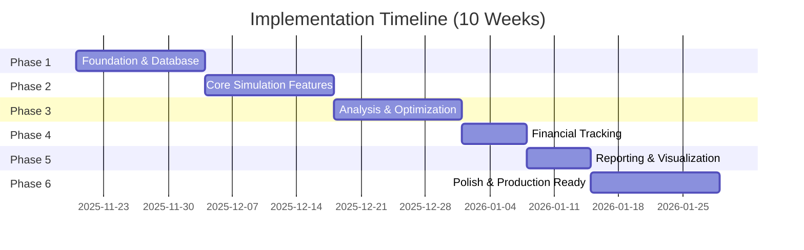
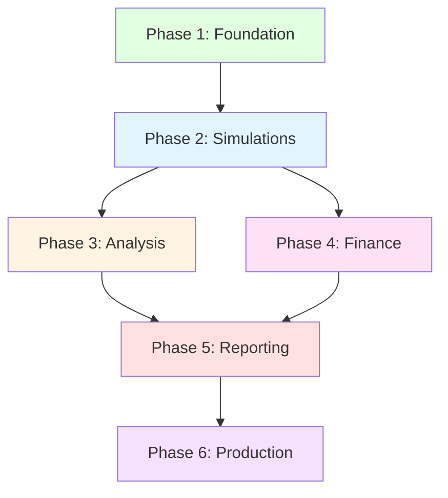

# Quina Lottery Simulation Platform — Implementation Plan

**Version:** 1.0  
**Date:** November 20, 2025  
**Status:** Planning Phase

---

## Table of Contents

1. [Overview](#overview)
2. [Timeline Summary](#timeline-summary)
3. [Phase Overview](#phase-overview)
4. [Dependencies & Critical Path](#dependencies--critical-path)
5. [Resource Allocation](#resource-allocation)
6. [Risk Management](#risk-management)
7. [Success Criteria](#success-criteria)

---

## Overview

This implementation plan breaks down the development of the Quina Lottery Simulation Platform into 6 distinct phases over 10 weeks. Each phase builds incrementally on the previous one, delivering working software at each milestone.

### Key Principles

- **Incremental delivery:** Each phase produces deployable artifacts
- **Test-driven:** Write tests before or alongside implementation
- **Documentation-first:** Update docs as features are built
- **Review gates:** Each phase requires approval before proceeding

### Development Approach

- **Agile/Iterative:** 2-week sprints (except Phase 1: 2 weeks)
- **Continuous Integration:** Automated testing on every commit
- **Code Reviews:** All code reviewed before merge
- **Pair Programming:** Complex algorithms developed in pairs

---

## Timeline Summary



| Phase | Duration | Start Date | End Date | Deliverable |
|-------|----------|------------|----------|-------------|
| Phase 1 | 2 weeks | Week 1 | Week 2 | Foundation + Import |
| Phase 2 | 2 weeks | Week 3 | Week 4 | Simulations + Workers |
| Phase 3 | 2 weeks | Week 5 | Week 6 | Analysis + Sweeps |
| Phase 4 | 1 week | Week 7 | Week 7 | Financial Tracking |
| Phase 5 | 1 week | Week 8 | Week 8 | Reports + Dashboards |
| Phase 6 | 2 weeks | Week 9 | Week 10 | Production Ready |

**Total Duration:** 10 weeks  
**Estimated Effort:** ~400 hours (1 developer full-time or 2 developers part-time)

---

## Phase Overview

### Phase 1: Foundation & Database (Weeks 1-2)

**Goal:** Establish project foundation, database infrastructure, and basic import functionality.

**Why This First:**
- Sets up the development environment for all future work
- Creates the data foundation required by all other features
- Validates the architecture before building complex features

**Key Deliverables:**
- ✅ Project structure and build system
- ✅ Database schemas and migrations for all 4 databases
- ✅ Import service (XLSX → SQLite)
- ✅ Results API endpoints (upload, import, query)
- ✅ Basic health check endpoint
- ✅ Unit tests for import logic

**Success Criteria:**
- Can import 5000+ lottery results from XLSX
- Import completes in < 30 seconds
- All 4 databases created with proper indexes
- Health endpoint returns 200 OK
- Test coverage > 70%

**Detailed Tasks:** See [Phase 1 Tasks](./plans/phase1_tasks.md)

---

### Phase 2: Core Simulation Features (Weeks 3-4)

**Goal:** Implement simulation engine, job system, and configuration management.

**Why This Phase:**
- Core business logic (prediction algorithms)
- Enables both simple and advanced simulation modes
- Background worker infrastructure for scalability

**Key Deliverables:**
- ✅ Engine service (ported from tools/loader.go)
- ✅ Simulation service with job management
- ✅ Background job worker (async execution)
- ✅ Configuration service (CRUD for recipes)
- ✅ Simple mode endpoint with presets
- ✅ Advanced mode endpoint with full recipes
- ✅ Recipe JSON schema validation

**Success Criteria:**
- Can run simulations synchronously and asynchronously
- Simulations complete in < 5 min for 100 contests
- Recipes are reproducible (same seed = same results)
- Worker can process jobs concurrently
- Test coverage > 75%

**Detailed Tasks:** See [Phase 2 Tasks](./plans/phase2_tasks.md)

---

### Phase 3: Analysis & Optimization (Weeks 5-6)

**Goal:** Build parameter sweep, comparison tools, and leaderboards.

**Why This Phase:**
- Enables discovering optimal configurations
- Provides competitive analysis across simulations
- Critical for research and optimization use cases

**Key Deliverables:**
- ✅ Analysis service (sweeps, comparisons)
- ✅ Parameter sweep endpoint (Cartesian product generation)
- ✅ Sweep job scheduler and executor
- ✅ Comparison endpoint (multi-simulation)
- ✅ Leaderboard endpoint (global rankings)
- ✅ Ranking algorithms (weighted scoring)

**Success Criteria:**
- Can schedule 100+ simulations in a sweep
- Sweeps execute in parallel (configurable concurrency)
- Leaderboard updates in real-time
- Comparison supports 10+ simulations
- Test coverage > 75%

**Detailed Tasks:** See [Phase 3 Tasks](./plans/phase3_tasks.md)

---

### Phase 4: Financial Tracking (Week 7)

**Goal:** Implement financial ledger and ROI analysis.

**Why This Phase:**
- Validates theoretical performance against reality
- Critical for users betting real money
- Relatively independent from other features

**Key Deliverables:**
- ✅ Finance service (ledger management)
- ✅ Ledger endpoints (transactions, prizes)
- ✅ ROI analysis endpoint
- ✅ Financial report endpoint
- ✅ Simulation-to-ledger linking

**Success Criteria:**
- Can record transactions in < 50ms
- ROI calculations are accurate
- Can generate financial reports for any time period
- Supports filtering by simulation
- Test coverage > 80%

**Detailed Tasks:** See [Phase 4 Tasks](./plans/phase4_tasks.md)

---

### Phase 5: Reporting & Visualization (Week 8)

**Goal:** Build dashboards and PDF report generation.

**Why This Phase:**
- User-facing feature for stakeholders
- Enables sharing results with non-technical users
- Depends on data from all previous phases

**Key Deliverables:**
- ✅ Report service (dashboards, PDFs)
- ✅ Simulation dashboard endpoint
- ✅ Financial dashboard endpoint
- ✅ PDF generation (simulation, financial, analysis)
- ✅ Chart generation (hit rates, trends, heatmaps)
- ✅ Bulk export endpoint

**Success Criteria:**
- Dashboard data loads in < 1 second
- PDFs generate in < 5 seconds
- Charts are publication-quality
- All reports include recipe JSON for reproducibility
- Test coverage > 70%

**Detailed Tasks:** See [Phase 5 Tasks](./plans/phase5_tasks.md)

---

### Phase 6: Polish & Production Ready (Weeks 9-10)

**Goal:** Performance tuning, documentation, deployment preparation.

**Why This Phase:**
- Makes the system production-ready
- Addresses technical debt
- Prepares for real-world usage

**Key Deliverables:**
- ✅ Performance optimizations (profiling, caching)
- ✅ Error handling improvements
- ✅ API documentation (OpenAPI/Swagger)
- ✅ User guide and recipe cookbook
- ✅ Deployment guide (Docker, systemd)
- ✅ Monitoring and logging setup
- ✅ Load testing and benchmarks

**Success Criteria:**
- API p95 response time < 200ms
- All endpoints documented
- Deployment automated
- Monitoring dashboards configured
- Load test: 100 concurrent users
- Test coverage > 80%

**Detailed Tasks:** See [Phase 6 Tasks](./plans/phase6_tasks.md)

---

## Dependencies & Critical Path



### Critical Path

1. **Phase 1 → Phase 2:** Must have database and import before simulations
2. **Phase 2 → Phase 3:** Must have simulations before analysis
3. **Phase 3 & Phase 4 → Phase 5:** Reporting requires both analysis and finance data
4. **Phase 5 → Phase 6:** Polish happens after all features complete

### Parallelization Opportunities

- **Phase 4 can start early:** Finance tracking is mostly independent
- **Phase 5 preparation:** Chart library research can happen during Phase 4
- **Documentation:** Can be written incrementally throughout

---

## Resource Allocation

### Team Structure (Recommended)

**Option A: Single Developer (Full-time)**
- Duration: 10 weeks (400 hours)
- Pros: Consistent architecture, deep knowledge
- Cons: Slower delivery, single point of failure

**Option B: Two Developers (Part-time, 50% each)**
- Duration: 10 weeks (200 hours each)
- Pros: Knowledge sharing, code review
- Cons: Coordination overhead
- Recommended split:
  - Dev 1: Backend services, database, engine
  - Dev 2: API handlers, workers, reports

**Option C: Two Developers (Full-time, overlapping phases)**
- Duration: 6-7 weeks (200 hours each)
- Pros: Fastest delivery
- Cons: Higher cost, more coordination
- Recommended split:
  - Dev 1: Phases 1, 2, 5 (infrastructure + reports)
  - Dev 2: Phases 3, 4, 6 (analysis + finance + polish)

### Skill Requirements

| Skill | Required Level | Used In |
|-------|---------------|---------|
| Go (Golang) | Advanced | All phases |
| SQLite / SQL | Intermediate | Phases 1, 2, 3, 4 |
| REST API Design | Intermediate | All phases |
| Algorithm Implementation | Advanced | Phase 2 |
| PDF/Chart Generation | Basic | Phase 5 |
| DevOps (Docker, CI/CD) | Intermediate | Phase 6 |

---

## Risk Management

### High-Risk Items

| Risk | Impact | Probability | Mitigation |
|------|--------|-------------|------------|
| **Algorithm complexity** | High | Medium | Port existing code, add tests early |
| **Performance bottlenecks** | Medium | High | Profile early, optimize indexes |
| **Scope creep** | High | Medium | Strict phase gates, MVP focus |
| **Data migration issues** | Medium | Low | Test with real data early |
| **PDF generation complexity** | Low | Medium | Evaluate libraries in Phase 4 |

### Mitigation Strategies

1. **Algorithm Complexity**
   - Re-use existing `tools/loader.go` code
   - Write comprehensive unit tests with known inputs/outputs
   - Pair programming for complex functions

2. **Performance**
   - Profile after Phase 2 (simulation bottlenecks)
   - Add database indexes proactively
   - Use background workers for heavy tasks

3. **Scope Creep**
   - Formal approval required to add features
   - Maintain "future enhancements" backlog
   - Focus on MVP for first release

4. **Testing**
   - Write tests alongside code (not after)
   - Target 75%+ coverage minimum
   - Integration tests for critical paths

---

## Success Criteria

### Phase Completion Criteria

Each phase is considered complete when:

1. ✅ All planned tasks are finished
2. ✅ Unit tests written and passing (coverage target met)
3. ✅ Integration tests passing for new features
4. ✅ Code reviewed and approved
5. ✅ Documentation updated
6. ✅ Demo successful to stakeholders
7. ✅ No critical bugs outstanding

### Overall Project Success

The project is successful when:

**Functional:**
- ✅ Can import lottery results from XLSX
- ✅ Can run simulations (simple and advanced modes)
- ✅ Can perform parameter sweeps
- ✅ Can track finances and calculate ROI
- ✅ Can generate reports (dashboard + PDF)

**Non-Functional:**
- ✅ API response time p95 < 200ms
- ✅ Simulation time < 5 min for 100 contests
- ✅ Test coverage > 80%
- ✅ Uptime > 99% (after deployment)
- ✅ All endpoints documented

**Business:**
- ✅ Non-technical users can run simulations
- ✅ Experiments are reproducible (recipes)
- ✅ Financial tracking validates strategies
- ✅ Setup time reduced from 30min to 2min

---

## Communication Plan

### Weekly Sync

- **When:** Every Monday, 10:00 AM
- **Duration:** 30 minutes
- **Attendees:** Dev team + PO
- **Agenda:**
  - Previous week accomplishments
  - Current week goals
  - Blockers and risks
  - Demo (if available)

### Phase Review

- **When:** End of each phase
- **Duration:** 1 hour
- **Attendees:** Dev team + stakeholders
- **Agenda:**
  - Demo of new features
  - Metrics review (coverage, performance)
  - Go/No-go decision for next phase
  - Feedback collection

### Daily Standups (Optional)

- **When:** Daily, 9:00 AM
- **Duration:** 15 minutes
- **Format:** Async (Slack/email) or sync call
- **Topics:** What I did, what I'm doing, blockers

---

## Quality Gates

### Code Quality

- **Linting:** `golangci-lint` must pass
- **Formatting:** `gofmt` enforced
- **Tests:** Minimum coverage per phase
- **Reviews:** All code reviewed before merge

### Phase Gates

Before proceeding to next phase:

1. **Code Complete:** All tasks implemented
2. **Tests Pass:** CI/CD green
3. **Coverage Met:** Target coverage achieved
4. **Docs Updated:** API docs, README current
5. **Demo Approved:** Stakeholder sign-off
6. **No Blockers:** All critical issues resolved

---

## Monitoring & Metrics

### Development Metrics

Track weekly:
- Lines of code written
- Test coverage percentage
- Number of tests added
- Code review turnaround time
- Bugs found and fixed

### Performance Metrics

Track after each phase:
- API response times (p50, p95, p99)
- Database query times
- Simulation execution time
- Memory usage
- CPU usage

### Tools

- **Version Control:** Git (GitHub/GitLab)
- **CI/CD:** GitHub Actions or GitLab CI
- **Testing:** Go built-in testing + testify
- **Coverage:** `go test -cover`
- **Profiling:** `pprof`
- **Monitoring:** Prometheus + Grafana (Phase 6)

---

## Detailed Task Files

Each phase has a detailed task breakdown document:

1. [Phase 1: Foundation & Database](./plans/phase1_tasks.md)
2. [Phase 2: Core Simulation Features](./plans/phase2_tasks.md)
3. [Phase 3: Analysis & Optimization](./plans/phase3_tasks.md)
4. [Phase 4: Financial Tracking](./plans/phase4_tasks.md)
5. [Phase 5: Reporting & Visualization](./plans/phase5_tasks.md)
6. [Phase 6: Polish & Production](./plans/phase6_tasks.md)

---

## Appendix: Estimation Methodology

### Story Points to Hours

- **Small (1 point):** 1-2 hours (simple CRUD, config)
- **Medium (2 points):** 3-5 hours (service logic, API endpoint)
- **Large (3 points):** 6-10 hours (complex algorithm, integration)
- **X-Large (5 points):** 11-20 hours (major feature, refactor)

### Buffer Time

- **Research/Learning:** 10% added to complex tasks
- **Code Review:** 15% of development time
- **Bug Fixing:** 20% of development time
- **Documentation:** 10% of development time

### Total Effort Calculation

```
Phase 1: 80 hours
Phase 2: 90 hours
Phase 3: 80 hours
Phase 4: 40 hours
Phase 5: 40 hours
Phase 6: 70 hours
-----------------
Total: 400 hours
```

With buffer: **400 × 1.15 = 460 hours** (includes contingency)

---

## Change Log

| Date | Version | Changes | Author |
|------|---------|---------|--------|
| 2025-11-20 | 1.0 | Initial planning document | Dev Team |

---

**Next Steps:**
1. Review and approve this plan
2. Set up development environment
3. Create detailed task tracking (Jira/Linear/GitHub Issues)
4. Begin Phase 1 implementation

**Questions?**
Contact the development team or schedule a planning review meeting.

